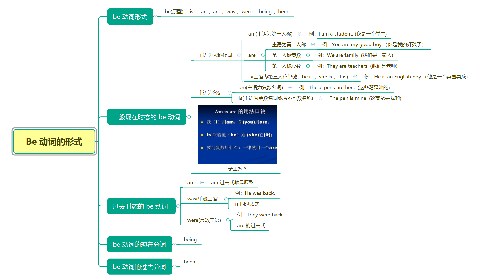
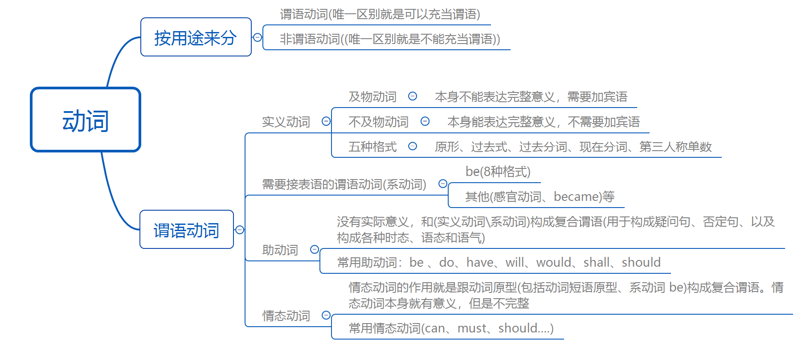

### 动词

>动词就是表示`动作`或`心理行为`的词语，需要特别注意的一点是：表示心理行为的词语也是动词，如：know(知道)、think(认为)、like(喜欢)，这些词语并不表示动作，而是表示心理行为，有时候还要注意中文跟英语不一样，一个词语在中文中是动词，在英文中不一定是，所以使用时要注意这一点。

#### 动词分类

动词从用法来分，可分为`谓语动词`和`非谓语动词`。它们的区别就是一个作谓语，另一个不能作谓语(作主语、宾语、补语 [宾补、表语] 等)；但是，同一个词不管是作谓语动词还是非谓语动词，意思都是一样，不会发生改变。

谓语动词有四种：`实义动词、系动词、助动词、情态动词`

#### 实义动词

**实义动词(有些语法书也称为行为动词)顾名思义，就是有实际意义的动词。**大部分动词都是有实际意义的，但是有少数动词时没有意义的，或者意义不完整的，比如系动词、助动词、情态动词。所以也可以这样理解：除了系动词、助动词、情态动词，剩下的就是实义动词。

**实义动词又分为不及物动词和及物动词**。

**及物动词：**及物动词是指动词本身不能表达完整的意思，后面必须接宾语，也就是加一个动作的对象或承受者才能表达完整的意思。比如：`买(buy)`这个动词，我们造句的时候，不可能只说：`我买`或者`你买`，如果不说买什么东西，别人一定认为你是神经病，所以像`买`这种动词，后面必须加一个动作的对象，如：`我买书`或`我买笔`，`书`和`笔`就是动作的对象，这样意思才完整，像`买(buy)`这种动词就是典型的及物动词。

构成句型：`主 + 谓语(及物动词) + 宾 + ...`

**不及物动词：**不及物动词是指不需要加宾语就能表达完整意思的动词，而且也不能加宾语，因为意思已经完整了。比如：`工作(work)`，`I work every day(我每天工作)`，意思就已经完整了。你不能说`你工作你?`或`你工作他?`这样说逻辑是有问题的，再比如`I live Beijing`这也是错的，因为`live`是不及物动词，不能跟宾语`Beijing`。不及物动词后面可以跟状语，所以表达`我在北京生活`应该是`I live in Beijing`，这里`in Beijing`是地点状语。

构成句型：`主 + 谓语(不及物动词) + 状语 `

不及物动词的数量不多，大部分实义动词都是及物动词。<u>也有一些实义动词既可以做及物动词也可以作不及物动词，此时可以通过意思进行区分</u>，因为作及物和不及物动词时通常意思不一样。如`run`这个动词既可以作及物动词也可以作不及物动词。做不及物动词的时候表示`跑步`，后面没有宾语。如`I run every morning.`，当它作及物动词的时候，表示`经营，管理`的意思，如：`I run website (我经营一个网站)`，这些都需要慢慢积累。

#### 实义动词的五种格式

任何一个实义动词都有五种格式，这五种格式为：**原形、过去式、过去分词、现在分词、第三人称单数格式。**五种格式都是同一个意思，如：`work、worked、worked、working、works`.

为什么动词会有五种不同的格式呢？

**因为英语有时态的变化，不同的时态，使用不同的动词形式；这就是英语的一大特点：变化。**

一般来说，过去式，过去分词、现在分词、第三人称单数格式都是由原形变化而来的，在原形的后面增加字母组合，这叫词尾变化，另外，`在有规则的情况下，过去式和过去分词式一样的`，都是在后面加字母组合`ed`。

规则变化：

- **变过去式和过去分词：在`原型后面 `+ `ed`**
- **变现在分词：在`原形后面 + ing`**
- **变第三人称单数格式：在`原形后面 + s`（注意不要和可数名词变复数混淆）**

| 原形  | 过去式  | 过去分词 | 现在分词 | 第三人称单数格式 |
| ----- | ------- | -------- | -------- | ---------------- |
| work  | worked  | worked   | working  | works            |
| learn | learned | learned  | learning | learns           |
| play  | played  | played   | playing  | plays            |

这是一般的规则(理想状态下的规则)，实际上，每个大规则下面还有小规则(不规律的变化)，下面分别介绍每种变化的小规则：

.... 暂时省略，后续补充。

#### 系动词

系动词也叫连系动词，系动词只有一个作用，就是跟表语构成`系表结构`作状态型谓语。系动词是不能单独使用的，必须和表语一起用，反过来说，表语也是不能单独用的。

最常用的系动词就是`be`，`be`由八种形式，分别是：`be、am、is、are、was、were、being、been`。

- 原形`be`用于助动词和情态动词后面或用在动词不定式里面，例：
  - She <u>will be</u> nurse next month. 她下个月将成为护士
- `am`用于第一人称`I`，例：
  - I <u>am</u> a teacher.
- `is`用于第三人称单数，例：
  - She is a student.
- `are`用于第二人称`you`和复数，例：
  - You <u>are</u> great. 你很伟大
- `was`单数主语，`is`的过去式，例：
  - He was a boos before. 他以前是老板
- `were`复数主语，`are`的过去式，例：
  - They were farmers before. 他们以前式农民
- `been`过去分词格式，例：
  - I have been a teacher  for three years. 我做老师三年了。(用于完成时态)
- `being`现在分词格式，例：
  -  A bridge is being built. 一座桥正在建设中。(被动语态)

`be`不管是哪一种格式，都是同一个意思，一般情况下相当于中文的`是`，有时候也可以不用翻译出来。

除了`be`，还有少数的实义动词可以充当系动词。这些动词作实义动词时和做系动词意思是不同的，比如`look(不及物)`作实义动词时是`看`的意思，表示一种动作时(想接宾语时)，一般要变成`look at`。作系动词时，`look`变成了`看起来`的意思，一般在后面接形容词作表语，例：

- you look beautiful.

常见的接表语构成`主 + 谓语 + 表`句型的"系"动词有以下几类(其实也可以分为两类`be和其他`)：

- be 
- 感官动词(感官动词是表达看、听、闻(味道)、尝、触这些感觉的动词)
- became(成为)、came(成为、变为)、seem (好像是)、turn(变成)、get(变成)、go(变成，进入...)

#### 助动词

**助动词是没有意思的，它的作用就是帮助实义动词或系动词构成复合谓语，或者构成疑问句，否定句，以及构成各种时态，语态和语气。**具体的用法在讲述时态和语态的时候会详细介绍。这里简单了解一下。

常用的助动词：**`be 、do、have、will、would、shall、should`**

注意：be(包含上述8种格式)、do(包含did、does)、have(包含has、had)是从系动词和实义动词那里“借”过来的，充当助动词的时候这几个词是没有意思的。

助动词的三个特点：

- 没有意思
- 不能单独用，用于帮助构成其他各种结构
- 没有专门的助动词，都是从其他动词“借”过来的

下面通过一些例子来学习助动词：

- I <u>am</u> working now. 我现在正在工作

这是一个现在进行时态的句子，这里的`am`属于助动词，不是系动词。如果是系动词，是完全不一样的，首先系动词后面必须接表语(名、形、代、介词短语等)，而这里后面是**接动词`working`组成`复合谓语`**，第二，作系动词时`am`时有意思的，而这里`am`是完全没有意思的，主要的作用是跟动词的现在分词构成现在进行时态。

- `Do` you love me ? 你爱我吗？(这里的`do`没有意思，帮忙构成一般疑问句，是一个从实义动词“借”过来的助动词。)

- I `do not love` you. 我不爱你(`do`没有意思，帮助构成一般现在时态否定句)
- I `did not love` you. 我以前不爱你(`did`没有意思，帮助构成一般过去时态否定句)
- She `does(主语为单三)` love you. 她不爱你(`dose`没有意思，帮助构成一般过去时态否定句)
- I `have` `learned` English for ten years. 我已经学英语十年了(这里的`have`没有意思，跟动词的过去分词`learned`一起构成现在完成时态，是一个从实义动词“借”过来的助动词。)
- She `has` `known` you for ten years. 她已经认识你十年了(这里的`has`没有意思，跟动词的过去分词`known`一起构成现在完成时态。)
- I `will` buy ten glasses tomorrow. 我明天买十个杯子(`will`没有意思，帮助构成一般将来时)
- I `do` love her .我确实爱他(`do`在肯定句里请强调语气，没有真正的意义)

#### 情态动词

**情态动词的作用就是跟动词原型(包括动词短语原型、系动词be)构成复合谓语。情态动词本身就有意义，但是不完整。**以下是常见的情态动词，在后面将详细介绍每个情态动词的用法，这里只是简单介绍。

| can(能、会)   | could(can的过去式) | may(可以)       | might(may的过去式) |
| ------------- | ------------------ | --------------- | ------------------ |
| should(应该)  | must(必须)         | have to(不得不) | dare(敢)           |
| Needn't(不必) | had better(最好)   | ought to(应该)  | be able to = can   |

情态动词的特点：

- 情态动词必须跟**动词原形**构成复合谓语
- 情态动词是有意义的，虽然意思不完整
- 有专门的情态动词，不需要“借用”其他动词
- 情态动词一般不能跟助动词连用

什么时候使用情态动词：

当我们需要表达情态动词的意义时使用，如`必须、能、应该`等等的时候，就可以使用对应的情态动词，构成复合谓语 ，例：

- I earn money every day. 我每天赚钱

  这句话没有情态动词，仅仅表达”每天赚钱“。但是如果我们需要表达`必须每天赚钱`，强调`必须`这个意义的话就需要加一个情态动词`must`，变成下面的句子：

  I `must earn`  money every day. 我必须每天赚钱。(这里的`must earn`就是`情态动词+动词原型`构成复合谓语。)

- I help you 我帮助你

  这句话没有情态动词，仅仅表示我`我经常帮助你`，如果想表达`我应该帮助你`时，需要使用`should`这个情态动词，变成下面的句子：

  I` should help `you. (这里的`should help`就是`情态动词+动词原型`构成复合谓语。)

  上述例子为 `主 + 谓 + 宾`结构，`情态动词+动词原型`组成`动作型复合谓语`同样在`主 + 系 + 表`结构种，也可以使用`情态动词+动词原型`组成`状态型复合谓语`，特别注意：一定要是动词原形，例：

- I am happy every day. 我每天高兴

  我们加上情态动词`must`来表达`我每天必须高兴`：

  I `must am` happy every day. (此时这句话是错误的，因为情态动词后面必须接动词原形，而`am`不是动词原形，动词原形应该是`be`)，所以正确的表达是：

  I must be happy every  day. `must be`组成复合谓语(状态型谓语)

  #### 总结

  

