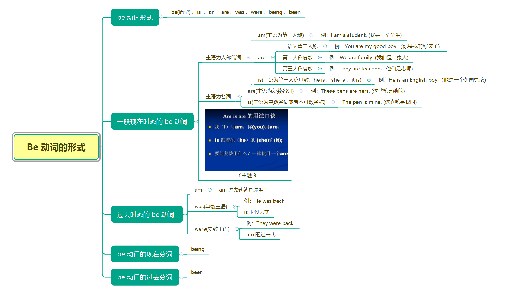

#### 英语五种基本句式

- 基本句式一：S  V (主 + 谓)
  - 主：表示主体
  - 谓：表示主体执行的动作
- 基本句式二：S  V  P (主 + 系 + 表)
  - 系：系动词，起到联系作用的动词，连接前面的主语和后面的表语
  - 表：表语，描述主语的性质，特点和位置的词
- 基本句式三：S  V  O (主 + 谓 + 宾)
  
  - 宾：宾语，动作执行的对象，动作执行在什么物体上谁就是
- 基本句式四：S  V  o  O (主 + 谓 + 间宾 + 直宾)
  
- 表示动作要作用在两个物体上，其中间宾一般指人，直宾指物
  
- 基本句式五：S  V  O  C (主 + 谓 + 宾 + 宾补)

  - 宾补：宾语补足语，当宾语不能完全说明谓语执行的对象及执行的对象的结果是什么时，就需要使用宾补进行补充说明宾语

#### 语序

  - 句式一：Subject(主语) + Verb(谓语)

    `The universe remains. 译：宇宙长存.(与中文语序一致)`

    其中 `universe` 表示主语，`remains` 表示谓语(动作)

  - 句式二：Subject(主语) + L.V(系动词) + P (表语)

    `The food is delicious. 译：这个食物很可口.(与中文语序一致！)` 

    其中 `food` 表示主语，`is` 表示系动词，`dilicious(可口，美味)` 形容词表示表语，这里主语没有动作，采用一个起到联系作用的词来代替，用来连接主语和后面的表语，没有任何实际意义

  - 句式三：Subject(主语) + Verb(谓语) + Object(宾语)

    `He took his bag and left. 译：他拿着他的包离开了.(与中文语序一致！)`

    其中 `He` 表示主语，`took 和 left` 表示谓语，`bag` 表示宾语

- 句式四：Subject(主语) + Verb(谓语) + I.o(间接宾语) + D.o(直接宾语)

  `Her father bought her a dictionary. 译：他爸爸给她买了一本字典.(与中文语序一致！)`

  其中 `Her` 表示主语，`bought` 表示谓语，`her` 表示间接宾语(指人)，`dictionary` 表示直接宾语(指物)

- 句式五：Subject(主语) + Verb(动词) + O(宾语) + C(补语)

  `We made him our monitor. 我们选他做我们的班长.(与中文语序一致！)`

  其中 `We` 表示主语，`made` 表示谓语，`him` 表示宾语，`our monitor` 表示宾语补足语

#### Be 动词的形式

`be(原形) 、is 、am 、are 、was 、were 、being 、been `

##### Be 动词的用法

be 动词的用法：后面接名词、形容词、地点副词或短语作补足语

- The man is <u>a teacher.</u> 接名词
- Mary's new dresses are <u>colorful(五颜六色).</u> 接形容词 
- my mother was <u>in the kitchen(在厨房)</u> 接地点副词

练习：

- 他们是老师。: `They are teachers.`
- 他以前是老师。：`The was  a teacher`
- 他已经当了3年老师。：`He has been a teacher for 3 years`

注意：be 动词有时态的变化，be 动词翻译的时候可以翻译为'是'或者什么都不翻译.