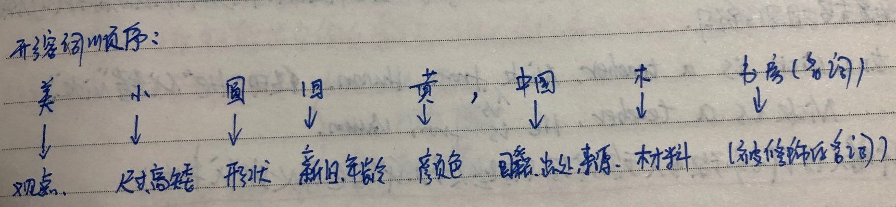

### 形容词

> 形容词[adjective，简称 adj]，是英语很常见的词类。形容词主要用来修饰名词或代词，表示人或事物的性质、状态和特征的程度好坏与否。

#### 形容词分类：

- 普通形容词
  - beautiful (漂亮的)、big (大的)、green (绿色)、happy (快乐)
  - long (长的) 、cheap (便宜的)、angry (生气的)、sad (伤心的)
- 复合形容词 ：复合形容词就是由两个或多个单词（多个单词不一定都是形容词，但有一个是）构成的一个新的单词，这个新词也属于形容词的词性。多个单词之间通常用`-`连接，如：
  - sky-blue (天蓝色的)、good-looking (好看的)、man-made (人造的)
  - second-hand (二手的)、warm-hearted  (热心的)、hard-working (努力工作的)

#### 形容的用法

- 形容词的用法很容易掌握，因为用法不多，一般是作**前置定语、表语和宾补。**

- **作表语：**大部分的形容词都可以作表语。形容词作表语可以直接构成一个句型：**主语 + be(系动词)+  形容词(表语)**，例：

  - I am **happy**. 我是快乐的 (形容词 happy 作表语)
  - She is **busy**. 她很忙 (形容词 busy 作表语)
  - They are **hard-working**. 他们努力工作 (复合形容词 hard-working 作表语)

- **做前置定语：**大部分的形容词都可以作前置定语，修饰普通名词，放在普通名词的前面。例：

  - The **big** house (形容词 big 作前置定语修饰名词)
  - A **happy** girl (形容词 happy 作前置定语修饰名词)
  - 注意：形容词做前置定语，只和名词有关系，且形容词 + 名词只构成短语，并不是能构成完整句子。当需使用形容词作前置定语修饰名词造句时，先拿一个普通名词造句，然后再这个普通名词前面增加一个形容词或多个形容词作前置定语。(**形容词只是用于修饰名词的附加成分，一个完整的句子去掉形容词依然是一个完整的句子**)，例：
    - I like the **small** house. 我喜欢这个小房子(small 是用于修饰house 的附加成分)
    - I bought a **cheap** computer. (cheap 便宜)

- **作宾语补足语：**形容词可以作宾补，但是只有当谓语是部分特定的及物动词时，后面才可以跟形容词作宾补；谓语：make(使、让)、keep(保持)、prove(证明)等等。例：

  - I **make** you **busy**. 我让你忙 (形容词 busy 作宾补)
  - We **keep** the room **clean**. 我们保持房间干净
  - All the facts **proved** him **right**. 所有的事实都证明他是正常
  - She **made** me **angry** last night. 她昨晚让我很生气

- **形容词的位置：**当出现**多个形容词同时修饰名词作前置定语时**，要考虑形容词之间的顺序。

  - 当多个形容词修饰一个名词时，大家记住一个准则：**观点形容词 + 描绘形容词**

    - 观点形容词：表示对事物的看法
    - 描述形容词：表示事物的本身特征

  - 形容词的先后顺序：越接近事物本质的形容词离名词越近，这里有个小口诀：(美小圆旧黄，中国木书房)，例：

    

    - a <u>beautiful</u> <u>tall</u> <u>young</u> girl.  一个年轻漂亮，身材高挑的女孩子
    - my <u>nice</u> <u>small</u> <u>brown</u> <u>leather</u>(皮革) bag.  我漂亮的棕色小皮包

#### 形容词的比较级

**大部分的形容词都有三个格式：原级、比较级、最高级**，`比较级`就相当于中文中`更...`的意思，`最高级`就相当于`最...`；不过英语的比较级和最高级的变化比中文的复杂，有以下几种变化规则：	

- 在`单音节形容词`或以`er、ow、ure、le结尾的双音节形容词`后面加 `-er、-est `或` -r 、-st`，例：

  |    原级     |     比较级     |     最高级     |
  | :---------: | :------------: | :------------: |
  | big (大的)  | bigger (更大)  | biggest (最大) |
  | thin (瘦的) | thinner (更瘦) | thinnest(最瘦) |

- 以`辅音字母 + y`结尾的形容词`改 y 为 i`，再加` -er 、-est`，例：

  |     原级     |       比较级       |       最高级        |
  | :----------: | :----------------: | :-----------------: |
  | early (早的) | earl`ier `(更早的) | earl`iest` (最早的) |
  | ugly (丑的)  |  ugl`ier `(更丑)   |   ugl`iest`(最丑)   |

- 以 `e` 结尾的形容词后直接加 `-r、-st`，例：

  |      原级       |        比较级        |        最高级         |
  | :-------------: | :------------------: | :-------------------: |
  | brave (勇敢的)  | brave`r` (更勇敢的)  | brave`st` (最勇敢的)  |
  | polite (礼貌的) | polite`r` (更礼貌的) | polite`st` (最礼貌的) |

- 大多数`双音节和多音节`的形容词，在前面加`more、most` 变比较级和最高级，例：

  |         原级         |            比较级            |            最高级            |
  | :------------------: | :--------------------------: | :--------------------------: |
  |  beautiful (漂亮的)  | `more` beautiful (更漂亮的)  | `most` beautiful (最漂亮的)  |
  |  important (重要的)  | `more` important  (更重要的) | `most` important  (最重要的) |
  | interesting (有趣的) | `more` interesting(更有趣的) | `most` interesting(最有趣的) |

- 例外的情况：

  - 某些单音节形容词，如`tried(累)、please、right、real、glad(高兴的)`等，加`more、most `变比较级和最高级
  - 复合形容词一般加`more、most `变比较级和最高级

- 不规则变化：除了有规则的变化，还有一些形容词变化比较级和最高级是不规则的，例：

  |   原级    |   比较级    |    最高级     |
  | :-------: | :---------: | :-----------: |
  | good/well |   better    |     best      |
  |    bad    |    worse    |     worst     |
  |    old    | older/elder | oldest/eldest |

  注：：`elder 、eldest`主要表达年长的，指排行高的，不一定指年龄大；一般用来构成哥哥姐姐，如：`elder sister 姐姐、elder brother 哥哥、younger brother 弟弟、younger sister 妹妹`

  He is the eldest. 他排行老大

#### 比较级的用法

> 形容词的比较级和最高级跟形容词原级一样的，可以作前置定语和表语、甚至是宾补（比较级和最高级可以看作是一种程度的加深，不改变词性和用法，也就是说形容词原级可以出现的地方比较级和最高级也可以出现)，例：

- I have a `better/good` way.我有一个 `更好的/好的` 方法。(形容词比较级 better 作前置定语)
- She is my `best` friend. 她是我最好的朋友(形容词最高级`best `作前置定语)
- Eating apples makes us `healthier`. 吃苹果让我们更健康。(形容词比较级`healthier `作宾补)

**当然，形容词的比较级和最高级作表语是最常见的，以下是形容词的比较级和最高级作表语的句型**：

- **A 超过 B  (当表示 `A事物(人)` 比 `B事物(人)` 强的时候，用下面的句型)：**
  - **`A + be + 形容词的比较级 + than + B (than + B是比较状语)`**，**句型里面的形容词一定要变成比较级格式，than 是一个连接词，中文`比`的意思，than 跟后面的词语一起构成比较状语**，一起构成`主 + 系动词(谓语) + 表语 + 比较状语`句型：
  - I am taller <u>than he/him(比较状语)</u>. 我比他高( than 后面的人称代词可以是主格也可以是宾格)
  - She is fatter <u>than me</u>. 她比我胖
  - My girlfriend is more beautiful <u>than her</u>. 我的女盆友比她漂亮
  - My book is more expensive than yours. 我的书比你的贵
- **A 不如 B (当表示 `A 事物(人)` 不如 `B事物(人)` 强的时候，用下面句型)：**
  - **`A + be not + 形容词的比较级 + than + B `**，这个句型很容易，**在上面句型的`be`动词后面 + `not`就可以了**，例：
  - I **<u>am not</u>** taller than he/him. 我没他高/他比我高。
  - She <u>**is not**</u> fatter than me.我没我胖/我比她胖
  - My girlfriend **<u>is not</u>** more beautiful than her. 我的女盆友没她漂亮
- **A 和 B 一样 (当表示 `A 事物(人)` 和`B事物(人)` 一样的时候，用下面句型)**
  - **`A + be + as + 形容词原级 + as + B`**，注意这里的形容词一定要用**原级，**`as...as`表示`和...一样`.
  - I am <u>as tall as</u> he/him. 我和他一样高
  - She is <u>as fatter as</u> me. 她和我一样胖
  - My girlfriend is <u>as beautiful as</u> her. 我的女盆友和她一样漂亮
- **A 是最什么的...(当表示在一定范围内，A事物(人)是最厉害的，用下面句型)**
  - **`A + be + the + 形容词最高级 + 表示范围的词语`**，注意：这里的形容词一定要用**最高级**，**并且前面需要加定冠词`the`**，这也是定冠词的一种用法；**且后面一定要加一个表示范围的词语**，一般是介词短语构成，这是因为“人外有人、天外有天”，这个事物(人)只可能在一定范围内是最强的.
  - He is <u>the richest</u> <u>in Guangxi</u>. 它是广西最有钱的
  - The house is <u>the highest</u> <u>in Guangzhou</u>. 这是广州最高的房子
  - He is <u>the most famous</u> <u>in China</u>. 他是中国最出名的
- **注意：在比较时，要注意逻辑问题，人只能和人比，事物只能和事物比.**

#### 作业

- A + be + 形容词比较级 + than + B，句型成分格式要求：
  - `A：形容词性物主代词 + 可数名词单数`+ `be：is` + `形容词比较级` + `than `+ `B：名词性物主代词/(限定词 + 可数名词单数)/人称代词`
  - My book is cheaper than `yours(名词性物主代词)`.
  - My book is cheaper than her pen. 我的书比她的笔便宜.

