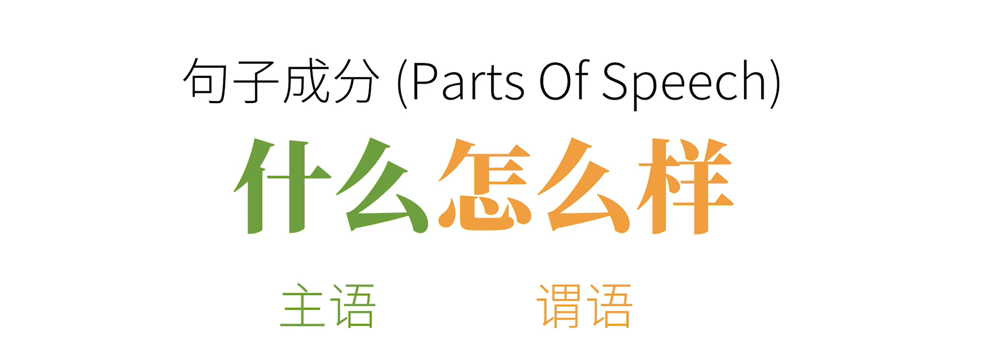
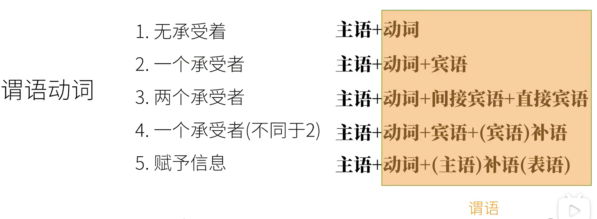
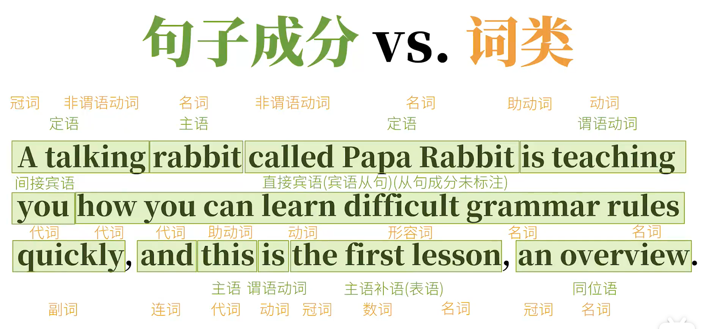
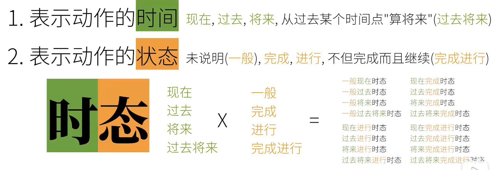
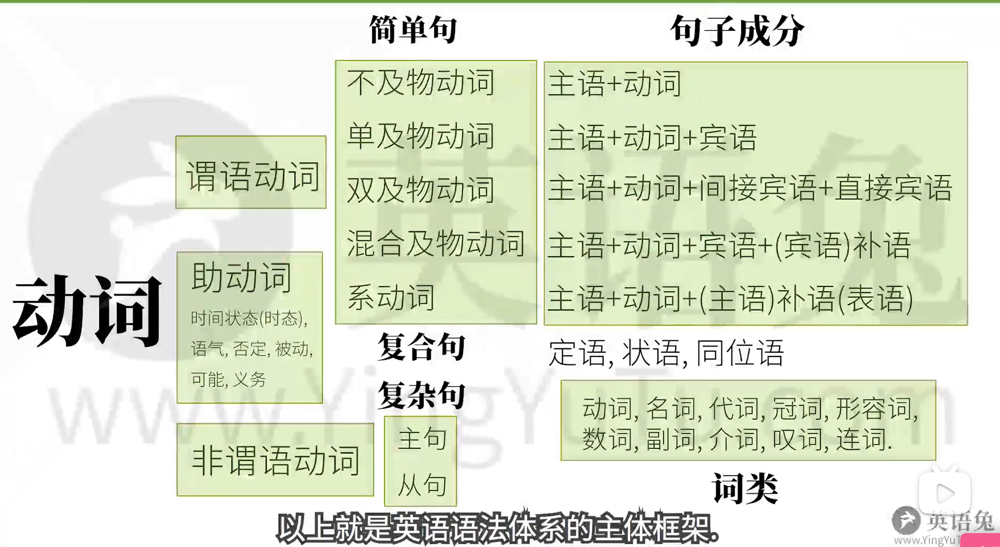

# 语法框架

> 学习语法的目的：造句

## 语句

语句，当基本句研究透了，复杂句就不难了

- 短句(简单句 Simple Sentences)；基本句：什么怎么样。
- 长句：有一系列短句组成；当分析长句时要将其拆开，直到拆的不能再拆了，否则句意会不完整的 -- "基本句"，才好研究语法；当基本句研究透了；长句子就是它们的组合；而基本句都是在说什么怎么样

## 基本句

基本句说的就是：什么怎么样；“什么怎么样”分别对应两个句子成分(Parts Of Speech)

- 什么（主语）：人或物
- 怎么样 （谓语）：广义的“动作”或发生了什么事情；注意这个“动作”并不是我们平时狭义说的“动起来”的动作；这个广义的“动作”也就是我们语法上说的“动词”(Verbs)

## 动作类型

那么总共有哪些类型的动作呢？

### 1.可以独立完成的动作

可以独立完成的动作：不及物动词(Intransitive Verbs) -- 这样没有承受者的动词叫做不及物动词

> Papa Rabbits `sleeps `兔老爹睡觉

句型结构：主语 + 不及物动词 

### 2.有一个承受者

动作有一个承受者：及物动词(Transitive Verbs) ；而动作的承受者就是宾语（Object）

> Papa Rabbit `like ` you. 兔老爹喜欢你

如果只说`兔老爹喜欢`，你肯定觉得意思不完整，因为像`喜欢`这样的动词没有承受者就没有实际意义，而动作的承受者就是宾语。

句型结构：主语 + 单及物动词（Monotransitive Verbs）+ 宾语

### 3.有两个承受者

动作有两个承受者：双及物动词

> Papa Rabbit `teaches `you English.

这里的核心动词时“teaches”，教授的知识是“英语”，而知识的接受对象是“你”，在语法上；我们把这样的动词的两个承受者分别称为“直接宾语（Direct Object）”和“间接宾语（Indirect Object）”；因为如果光说`兔老爹教英语`其实语义已经完整了，所以`英语`在这里是直接宾语；而反过说`兔老爹教你`而又没有上下文的话语义是不完整的，所以`你`是间接宾语。

句型结构：主语 + 双及物动词（Ditransitive Verbs) + 间接宾语 + 直接宾语

### 4.有一个承受者（需补充信息）

动作有一个承受者（不同于上一种，需补充信息）：复杂及物动词（Complex-transitive Verbs）

> Papa Rabbit `considers `you smart. 兔老爹认为你聪明

这里的核心动词时“considers ”，这一种只有一个动作承受者“你”，但是如果只说`兔老爹认为你`，你肯定觉得话没有说完(不同于第二种)；但是宾语`你`后面的`聪明`又不像另一个动作承受者，这样的动词，必须要有一个补充承受者的信息才完整，而这个补充的信息我们在语法上称为补足语或补语(Complement)，更明确地说称作宾语补语(Object Complement)，这样的动词我们称为复杂及物动词（Complex-transitive Verbs）。

句型：主语 + 复杂及物动词（Ditransitive Verbs) + 宾语 + 宾语补语

### 5.不是个”动词“(赋予信息)

这种情况和咱们“狭义”上说的动作不一样；这个”动词“描述的是一种状态。

> Papa Rabbit `is` tall.
> Papa Rabbit  = tall

这里的`is`常常翻译为`是`，但其实它的作用很简单，就是把这个动词之后的信息**赋予**给前面的主语`Papa Rabbit  = tall`；也就是`is`这一类的词的作用就是将动词之后的信息赋予给前面的主语；这一点很重要。如：

> Papa Rabbit looks tall.

这句话其实就是就是将`tall = （赋予）Papa Rabbit `，只不过比之前的`is`多了个`看上去`的意义而已；我们把像这种赋予主语某种性质状态的`划等号`的动词称为连系动词(Linking Verbs)，也被称为系动词；而系动词后的补充信息也自然就是补语了，更精确的称为主语补语(表语)。

句型：主语 + 系动词(linked-verbs) + 主语补语(表语)

以上这五种基本动词所对应的简单句的类型可以说是涵盖了英语的所有的句子，那些长长的，让人看起来眼花缭乱的负责句只不过是这五种类型的组合而已。

其实这几种句型就是在说动词，以及动词需要几个对象才能完整表达意思。

## 谓语和谓语动词

严格来说；谓语和谓语动词是有区别的，句子主语后面余下的部分就是谓语；谓语动词只是谓语的一部分；但平时为了方便直接把谓语动词称为谓语，把其他部分称为宾语，补语等，这也是没问题的。

## 句子成分（Parts Of Speech）

1. 主语 Subject

2. 谓语动词(~谓语) Predicate Verb

3. 宾语 Object

4. 宾语补足语 Object Complement

5. 主语补足语 Subject Complement 或称为 表语 Predicative

6. 定语 Attribute 

   主要用来修饰主语或宾语，如：

   > `The little white` rabbit ate `a large` carrot.

   `The little white`就是主语`rabbit`的定语；而`a large`就是宾语`carrot`的定语

7. 状语 Adverbial

   主要用来修饰谓语动词，如：

   > The rabbit ate `quickly`. 兔子快速吃

   `quickly`就是`ate`的状语。

8. 同位语 Appositive

    主要用来再把主语或者宾语说一遍，如：

    > Papa Rabbit, `an English teacher`, eats a carrot. 兔老爹，一个英语老师，吃胡罗卜

    其实就是把`Papa Rabbit`用不同的方式再说一遍。

**需要强调的是，上述我们说的都是所谓的“简单句”，说白了就是没法拆成更多了的句子；可是说话写文章可不全是简单句一个接一个的说，而是把这些不同的简单句互相组合形成所谓的`复合句（compound sentences）`和`复杂句(complex sentences)`.**

## 长句(复合句和复杂句)

- 复合句（compound sentences）

- 复杂句（complex sentences）

### 复合句(compound sentences)

> 复合句(compound sentences)：其实说白了就是句子的简单叠加，是并列关系
>
> `简单句 `+ `简单句`

### 复杂句(complex sentences)

>复杂句(complex sentences)：其实说白了就是把一个句子套在另一个句子里，甚至一个句子的句子还能再套一个句子...一直套下去，此处并不禁止套娃；这是一种从属关系。
>
>这种一个句子套另一个句子的形式，在英语语法上分别叫做`主句（Main clause）`和`从句（subordinate clause）`.

#### 从句（subordinate clause）

> 从句（subordinate clause）：说白了就是把简单句修改一下来充当另一个句子的句子成分。比如修改一个简单句，它可以充当另一个句子的主语，这叫主语从句...

- 主语从句：就是修改一个简单句让它充当另一个句子的主语
- 宾语从句：就是修改一个简单句让它充当另一个句子的宾语
- 主语补足语(表语)从句：就是修改一个简单句让它充当另一个句子的表语
- 同位语从句：就是修改一个简单句让它充当另一个句子的同位语

以上这些从句都具有名词的性质；所以统称为`名词性从句`。我们修改一个简单句它充当另一个句子定语、状语，很显然那些就是`定语从句、状语从句`。

## 词类

在同一类句型种可能存在不同的词类。所以我们需要了解英语的词类，如：

|    主语    | 谓语 |         宾语         |
| :--------: | :--: | :------------------: |
| The Rabbit | ate  |       a carrot       |
|     He     | saw  | something over there |

1. 名词 Nouns：表人和物

   > `Papa Rabbit（专有名词）` is a `rabbit（普通名词）`

2. 冠词 Articles：说明人和事物

   > Papa Rabbitis `a` rabbit

3. 代词  Pronouns ：代替人或事物

   > `I` am rabbit.

4. 形容词 Adjecctives：形容人和物

   > I am a `smart` rabbit.

5. 数词 Numerales：表数量

   > I ate `two` carrots

6. 副词 Adverbs：修饰形容词、动词、副词、句子等

   > I ate two carrots `quickly`

7. 介词 Prepositions：表示和其他词关系的词

   > I ate two carrots `with` chopsticks.

8. 叹词 Interjections：表感叹

   > `Ah`, the carrot is tasty.

9. 连词 Conjunctions：连接词和句

   > I ate two carrots `and` a potato. `because`I was hungry.

10. 动词 Verbs

## 句子成分 VS(Versus) 词类

句子成分和句子中的词类是完全不同的概念，这里面每一种句子成分，除了谓语动词是动词外，其他成分都可能包含不同的词类，谓语动词只可能是动词。

## 谓语动词的本领

谓语动词的“三大本领”：

1. 表达动作的时间：过去、现在、将来、从过去某个时间点“算将来”(过去将来)
2. 表达动作的状态(体)：未说明(一般)、完成、进行、不但完成而且继续(完成进行)

   以上两种合在一起称为时态，英语中的时态是由时间+状态两种组成，而不是其中某一种。而动词的时间和状态在一起进行排列组合就形成了16种可能的时态：

3. 表示动作的假设，情感等；这个叫做动词的语气，语法的语气

   1. If I were a rabbit... 虚拟语气

      用来表示意愿和事实相反的假设等；这里暗示了我其实并不是一只兔子。

   2. I ate a carrot and... 陈述语气

   3. Eat this carrot and... 祈使语气

以上3种特性被称为TAM(Tense 时 Aspect 体 Mood气).

**英语的谓语动词往往是不能够独立完成以上的本领以及其他本领，而且谓语动词独自也无法完成比如：否定、可能性、必须性等意思，想让谓语动词充分发挥作用，我们必须使用另一类词来帮助完成任务；它就是助动词(Auxiliary verbs)**

## 助动词

比如`吃 eat`这个动词；

- 为了协助它表示吃过了(完成态)，就要用到助动词 - `have`，e.g.(例如)`have eaten`
- 为了协助它表示正在吃(进行态)，就要用到助动词 - `be`，e.g. `is eating`
- 为了协助它表示是被吃，就要用到助动词 - `be`，e.g. `is eaten`

- 为了协助它表示是有能力吃，就要用到助动词 - `can`，e.g. `can eat`
- 为了协助它表示是有可能吃，就要用到助动词 - `might`，e.g. `might eat`
- 为了协助它表示是有义务吃，就要用到助动词 - `must`，e.g. `must eat`
- 为了协助它表示否定，就要用到助动词 - `do`，e.g. `do not eat`

**它们作助动词时，没有实际意义，只是帮助谓语动词而已。**但是它们也可以作实义动词，作实义动词时：`have - 拥有，be - 存在，can - 易拉罐，might - 力量，must - 发霉，do - 做`；所以千万不要把助动词和它的其他身份(实义动词)弄混淆.

## 谓语动词和非谓语动词

**动词除了谓语动词外，还有非谓语动词。**因为动词除了充当句子中的谓语动词之外；还可能充当其他成分；只不过需要把谓语动词修改一下；改为非谓语动词；**非谓语动词几乎可以取代所有的从句，从而简化句子，只不过这样的动词就不再具备表示时间、状态、语态、语气的功能，也就是它们丧失了时态、语气、语态这些本领了**；它们是以不同的形式出现在句中，包括：

- 动词不定式， e.g. `to eat`
- 现在分词， e.g. `eating`
- 动名词， e.g. `eating`
- 过去分词，e.g. `eaten`

## 总结

**重点：英语语法说来说去就是在说动词，动词 = 英语的核心；总结：**

