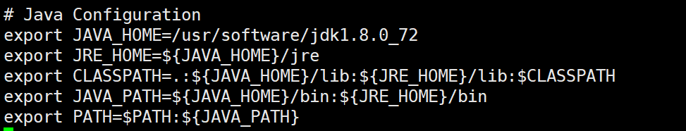
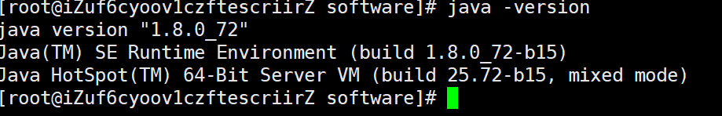
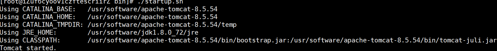
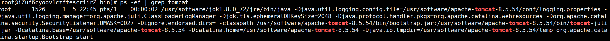
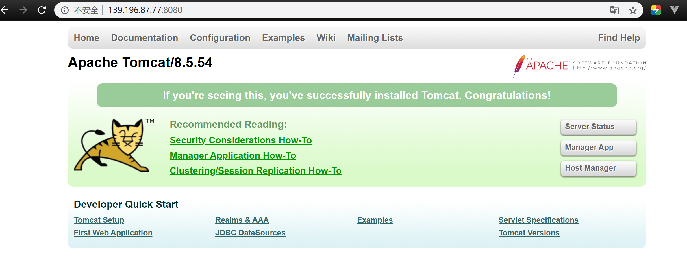

### Linux 安装 Tomcat 和 JDK

> 记录如何在 Linux 上安装 Tomcat 服务器 和 JDK；环境：Tomcat8 、JDK1.8、阿里云 Centeos 7.7

#### 准备工作

- 官网下载 Tomcat、JDK，Tomcat，
- 使用 SSH 传输工具上传至 Linux
- 放置位置：在`/usr`目录下新建`software`文件夹来存放软件，当然你也可以自定义放置文件的位置

#### 安装JDK

- 解压JDK

  `tar zxvf jdk-8u72-linux-x64.tar.gz`

- 配置环境变量，`/ect/profile`文件

  `vi /etc/profile`

  

- 重新加载配置文件：`source /etc/profile`

- 验证是否安装成功：`java -version`，如果不放心可以创建一个`Hello.java`，使用`javac Hello.java、java Hello`编译执行一段Java代码

  

#### 安装Tomcat

- 解压Tomcat

  `tar zvxf apache-tomcat-8.5.54.tar.gz`

- 配置端口，默认端口为8080，可以在`tomcat目录/conf/server.xml`更换端口

- 启动Tomcat，`cd tomcat目录/bin/`，执行`./startup.sh`脚本

  

- 停止Tomcat，执行`./shutdown.sh`脚本

- 验证是否启动成功，`ps ef | grep tomcat`

  

#### 开放端口

默认阿里云是没有开放`8080`等端口的，外网是不能访问的，需要进入阿里云控制台配置安全组规则，允许外网访问`8080`端口，后面如有其他端口不能访问也是由于没有开放

详细文档配置：https://help.aliyun.com/document_detail/25475.html?spm=5176.2020520101.0.0.4b144df5dZSvAP#allowHttp

此时便可以访问 Tomcat 服务器了。

