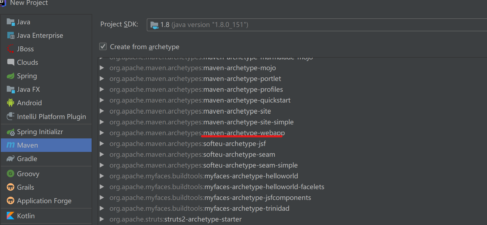
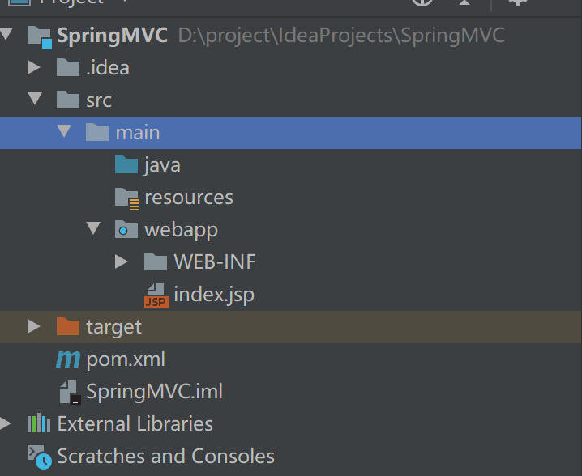
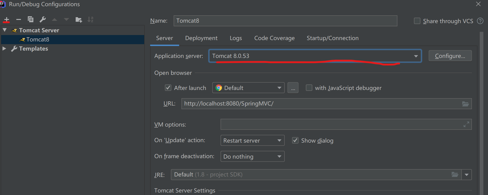
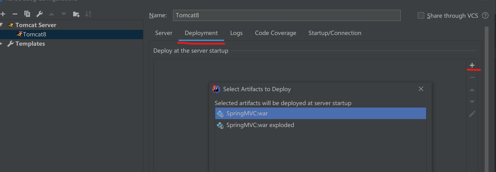

### 基于XML搭建 `SpringMVC` 应用

> 介绍基于XML如何从零开始搭建 `SpringMVC`应用，Demo环境：`IDE：IDEA`，`Web服务器：Tomcat`，`构建工具：Maven`

#### 创建工程：

- 第一步：创建一个`Maven Web`工程，选择红线标注处，点击`next`输入项目名称即可



- 第二步：`pom.xml`加入`SpringMVC`依赖

```java

<dependency>
    <groupId>org.springframework</groupId>
    <artifactId>spring-webmvc</artifactId>
	<version>5.1.5.RELEASE</version>
</dependency>
 <!-- servlet 依赖 -->
<dependency>
   <groupId>javax.servlet</groupId>
   <artifactId>javax.servlet-api</artifactId>
   <version>4.0.1</version>
   <scope>provided</scope>
</dependency>
```

- 第三步：下载完成后`Maven`项目结构如下，如果没有`java和resource`目录，自己手动创建一下即可，并分别标记为`Java 源文件、资源文件`



- 第四步：配置Tomcat，点击 `+` 处创建Tomcat，`Application server`处选择本地Tomcat文件的目录



- 第五步：将当前项目部署到Tomcat上去



至此，项目配置完成，启动Tomcat并访问`index.jsp`页面

#### `SpringMVC`配置

- 在`web.xml`中配置 `DispatcherServlet`，为什么要配置`DispatcherServlet`?

   官网描述：
```
Spring MVC, as many other web frameworks, is designed around the front controller pattern where a central Servlet, the DispatcherServlet, provides a shared algorithm for request processing, while actual work is performed by configurable delegate components. This model is flexible and supports diverse workflows.

The DispatcherServlet, as any Servlet, needs to be declared and mapped according to the Servlet specification by using Java configuration or in web.xml. In turn, the DispatcherServlet uses Spring configuration to discover the delegate components it needs for request mapping, view resolution, exception handling, and more.

翻译：Spring MVC，和大多数web框架一样，是围绕着前端控制器模式设计的，有一个中心的Servlet ->`DispatcherServlet`，提供请求处理的共享算法`（即分发请求）`，真正工作的是由可配置委托组件执行，该模型灵活并支持多种工作流.

**`DispatcherServlet`，和其他Servlet一样，需要使用`JAVA Configuration`或在`web.xml`根据Servlet规范声明和映射**，然后，`DispatcherServlet`使用spring配置来发现请求映射、视图解析、异常处理等所需的委托组件。
```

```java
<!DOCTYPE web-app PUBLIC
 "-//Sun Microsystems, Inc.//DTD Web Application 2.3//EN"
 "http://java.sun.com/dtd/web-app_2_3.dtd" >
<web-app>
  <display-name>Archetype Created Web Application</display-name>
  
  <!--  编码过滤器，保证客户端请求进行正确转码，但只对POST请求有效-->
  <filter>
    <filter-name>characterEncodingFilter</filter-name>
    <filter-class>org.springframework.web.filter.CharacterEncodingFilter</filter-class>
    <init-param>
      <param-name>encoding</param-name>
      <param-value>UTF-8</param-value>
    </init-param>
    <init-param>
      <param-name>forceEncoding</param-name>
      <param-value>true</param-value>
    </init-param>
  </filter>

  <filter-mapping>
    <filter-name>characterEncodingFilter</filter-name>
    <url-pattern>/*</url-pattern>
  </filter-mapping>
  
<!--
  为什么要配置DispatcherServlet，且需要在web.xml中配置？
  在MVC框架中，想拦截HTTP请求，有两种方法，一种是通过过滤器，一种是通过Servlet，而SpringMVC采用的是后者，也就是
  DispatcherServlet是一个Servlet（继承自HttpServlet），因此使用时需要把它配置在Web应用的部署描述符web.xml中
-->
  <servlet>
    <!-- servlet 名称-->
    <servlet-name>springmvc</servlet-name>
    <!-- servlet对应的类-->
    <servlet-class>org.springframework.web.servlet.DispatcherServlet</servlet-class>
    <!--  contextConfigLocation 是参数名称，该参数的值包含 SpringMVC 的配置文件路径-->
    <init-param>
      <param-name>contextConfigLocation</param-name>
      <param-value>WEB-INF/springmvc-config.xml</param-value>
    </init-param>
    <!-- 在Web应用启动时立即加载Servlet-->
    <load-on-startup>1</load-on-startup>
  </servlet>
  <!--  Servlet映射声明-->
  <servlet-mapping>
  	<!-- 请求对应的Servlet名称-->
    <servlet-name>springmvc</servlet-name>
 	<!-- servlet拦截请求：拦截当前域的所有请求-->
    <url-pattern>/</url-pattern>
  </servlet-mapping>
</web-app>
```
- 配置`springmvc-config.xml`，该文件为`Spring MVC`配置文件：

```java
<?xml version="1.0" encoding="UTF-8"?>
<beans xmlns="http://www.springframework.org/schema/beans"
       xmlns:xsi="http://www.w3.org/2001/XMLSchema-instance"
       xmlns:mvc="http://www.springframework.org/schema/mvc"
       xmlns:p="http://www.springframework.org/schema/p"
       xmlns:context="http://www.springframework.org/schema/context"
       xsi:schemaLocation="http://www.springframework.org/schema/beans
       http://www.springframework.org/schema/beans/spring-beans.xsd
       http://www.springframework.org/schema/context
       http://www.springframework.org/schema/context/spring-context.xsd
       http://www.springframework.org/schema/mvc
       http://www.springframework.org/schema/mvc/spring-mvc.xsd">

    <!--    自动扫包 Spring可以自动去扫描base-package下面的包及子包的文件，
    如果扫描到有Spring相关注解的类，则把这些类注册为Spring的Bean-->
    <context:component-scan base-package="com.xbhel.controller"/>
    <!--   默认装配方案，会自动注册：
    映射器：
    org.springframework.web.servlet.mvc.method.annotation.RequestMappingHandlerMapping
    适配器：
    org.springframework.web.servlet.mvc.method.annotation.RequestMappingHandlerAdapter
    -->
    <mvc:annotation-driven/>
    <!--
    ＜mvc：default-servlet-handler/＞是Spring MVC的静态资源处 理器，在web.xml中，如果将DispatcherServlet
    请求映射配置为“/”，则 Spring MVC将捕获Web容器所有的请求，包括静态资源的请求，因此会覆盖Servlet容器对静态资源的默认处理。
    此时我们需要显示配置＜ mvc：default-servlet-handler/＞，该会在Spring MVC上下文中定
    义一个 org.springframework.web.servlet.resource.DefaultServletHttpRequestHandler， 它会对进入			       DispatcherServlet的URL进行筛查，如果发现是静态资源的请求，就将该请求转由 Web 应用服务器默认的 Servlet处 理；如果不是静     态资源的请求，才由DispatcherServlet继续处理
    -->
    <mvc:default-servlet-handler/>

    <!--   视图解析器InternalResourceViewResolver来解析视 图，将View呈现给用户。视图解析器中配置的prefix属性表
    示视图的前 缀，suffix表示视图的后缀-->
    <bean id="viewResolver" class="org.springframework.web.servlet.view.InternalResourceViewResolver"
          p:prefix="/WEB-INF/content" p:suffix=".jsp">
    </bean>
</beans>
```

- 编写测试类测试并访问 http://localhost:8080/SpringMVC/hello ，访问成功即配置成功：

```java
@Controller
public class HelloController {
	@ResponseBody
    @RequestMapping(value = "/hello",method = RequestMethod.GET)
    public String hello(){
        return "Hello SpringMVC!";
    }
}

```