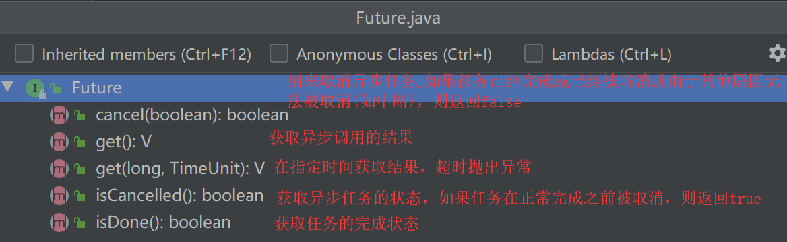

### spring 定时任务 & 异步调用

本篇仅限于 Spring 定时任务 & 异步调用的基本使用，不涉及深入原理探究，先学会怎么用，在探究原理.

环境：`SpringBoot 2.0`

#### 定时任务

>指的是应用程序在指定的时间执行预先定义好的程序片段
>

在 `Spring` 中使用定时任务非常简便，分为三步：

- 编写定时任务类并注入到 `IOC` 容器，一般使用 `@Component` 注入
- 编写定时任务方法并使用 `@Scheduled` 标记，这里需要了解一个叫 `Cron 表达式`的知识点
- 在 `SpringBoot` 启动类上使用 `@EnableScheduling` 开启定时任务功能

```java
/**
 * 1、注入到 IOC 容器，定时任务不属于 service 或 controller，一般使用 @Component 标注
 */
@Slf4j
@Component
public class HelloScheduled {

    /**
     * 2、编写定时任务方法并使用 @Scheduled 标记
     * 注意：@Scheduled cron 属性中书写的是 cron 表达式，如下的 cron 表达式表示：每隔5秒执行一次
     */
    @Scheduled(cron = "*/5 * * * * ?")
    public void scheduled() {
        log.info("使用 Spring @Scheduled 制定定时任务");
    }

}

/**
 * 3、在 `SpringBoot` 启动类上使用 `@EnableScheduling` 开启定时任务
 */
@EnableScheduling
@SpringBootApplication
public class SpringAllApplication {
    
    public static void main(String[] args) {
        SpringApplication.run(SpringAllApplication.class, args);
    }
    
}
```

#### 自定义配置文件

上述代码我们是在`SpringBoot`启动类上使用`@EnableScheduling`开启定时任务，而在实际开发我们会使用`JavaConfig`配置并约束`package`，使得指定的组件只有在指定`package`才有效.

```java
/**
 * 定时任务只扫描 HelloScheduled 类所在的包
 */
@EnableScheduling
@Configuration
@ComponentScan(basePackageClasses = com.xbhel.springall.component.scheduled.HelloScheduled.class)
public class ScheduledConfig {
}
```

#### 异步调用

> 异步调用是相对同步调用而言，同步调用指的是程序按照指令一步步执行，每一步都必须等待上一步执行完成后才可以执行，同步调用具有依赖性，而异步调用无需等待上一步执行完成便可以执行，即异步调用不依赖上一步操作，所有可以并发执行.

在 `Spring` 中使用异步调用也非常简便，分为三步：

- 编写业务类并注入到`IOC`容器中
- 编写异步调用方法并使用`@Async`标记
- 在`SpringBoot`启动类上使用`@EnableAsync`开启异步调用功能

```java
/**
 * 1、注入到 IOC 容器
 */
@Slf4j
@Service
public class HelloAsync {

    /**
     * 2、编写异步调用方法并使用`@Async`标记
     */
    @Async
    public void async() {
        log.info("HelloAsync class Thread Name {}",Thread.currentThread().getName());
        Stream.iterate(0, e -> ++e)
                .limit(10)
                .forEach(e -> log.info("HelloAsync class async method {}", e));
    }
}

/**
 * 3、在 `SpringBoot` 启动类上使用 `@EnableAsync` 开启定时任务
 */
@EnableAsync
@SpringBootApplication
public class SpringAllApplication {
 
    public static void main(String[] args) {
        SpringApplication.run(SpringAllApplication.class, args);
    }
    
}
```

#### 获取异步调用结果

在异步调用中，我们并不知道程序何时结束，从而无法获取它的结果，但有些时候我们需要获取异步调用的结果，此时就需要应用到`Java`提供的`Future Interface`，它的原理是基于回调机制.

回调机制可以看这里：[回调函数（callback）是什么？](https://www.zhihu.com/question/19801131/answer/27459821)

```java
@Async
public <T> Future<T>  asyncResult(T t){
    Stream.iterate(0, e -> ++e)
         .limit(10)
         .forEach(e -> log.info("HelloAsync class asyncResult method {},{}", e,t));
    //通过AsyncResult 返回结果
    return new AsyncResult<>(t);
}

public String testAsync() throws ExecutionException, InterruptedException {
   final String info="hello";
   Future<String> result = async.asyncResult(info);
   //在 async task 结束之前一直阻塞，task 执行完毕并返回结果
   return result.get();
}
```

`Future`中提供了一系列方法获取异步任务的状态



#### 自定义线程池

默认情况下异步调用使用的线程池是`SimpleAsyncTaskExecutor`，该线程池是不被推荐，因为该线程池的线程不重用，每次调用都会创建一个新的线程，一般我们都会自定义一个线程池进行服用，同样使用`JavaConfig`配置并约束`package`

```java
@EnableAsync
@Configuration
@ComponentScan(basePackageClasses = com.xbhel.springall.component.async.HelloAsync.class)
public class AsyncConfig{
    private static final String THREAD_PREFIX = "SpringAll-";
    
    @Bean("asyncExecutor")
    public Executor getAsyncExecutor() {
        ThreadPoolTaskExecutor executor = new ThreadPoolTaskExecutor();
        //线程池名称前缀
        executor.setThreadNamePrefix(THREAD_PREFIX);
        //线程池的默认线程
        executor.setCorePoolSize(3);
        //线程池最大线程数
        executor.setMaxPoolSize(10);
        //线程缓存队列
        executor.setQueueCapacity(100);
        //线程空闲时间
        executor.setKeepAliveSeconds(60);
        /*
            线程池对拒绝任务的处理策略(rejection policy)：
            当线程池已经达到最大线程数量，没有空闲线程时，新任务该如何处理
            可选策略：
            CallerRunsPolicy:当线程池没有能力处理时直接在执行方法的调用线程中运行被拒绝的任务
            如果执行程序已经关闭，将丢弃该任务.
            AbortPolicy:处理程序遭到拒绝时将抛出 RejectedExecutionException
         */
        executor.setRejectedExecutionHandler(new ThreadPoolExecutor.CallerRunsPolicy());
        //等待所有任务调度完成在关闭线程池，保证所有的任务被正确处理
        executor.setWaitForTasksToCompleteOnShutdown(true);
        //线程池关闭时等待其他任务的时间，不能无限等待，确保应用最后能被关闭。而不是无限期阻塞
        executor.setAwaitTerminationSeconds(60);
        //线程池初始化
        executor.initialize();
        return executor;
    }
}
```

此时，只需在原来的异步任务的`@Async()`注解中指定使用自定义线程池即可

```java
@Async("asyncExecutor")
public void async() {
    log.info("HelloAsync class Thread Name {}",Thread.currentThread().getName());
    Stream.iterate(0, e -> ++e)
          .limit(10)
          .forEach(e -> log.info("HelloAsync class async method {}", e));
}
```

#### 应用程序范围

上述我们需在``@Async()`注解中指定使用自定义线程池才有效，那有没有应用程序范围的呢，不需要每次指定，默认就会使用自定义线程池呢？

这时可以通过`implement AsyncConfigurer` 或` extend AsyncConfigurerSupport`创建应用程序范围的.

```java
@EnableAsync
@Configuration
@ComponentScan(basePackageClasses = com.xbhel.springall.component.async.HelloAsync.class)
public class AsyncConfig extends AsyncConfigurerSupport {

    private static final String THREAD_PREFIX = "SpringAll-";
    
    @Override
    public Executor getAsyncExecutor() {
        ThreadPoolTaskExecutor executor = new ThreadPoolTaskExecutor();
        executor.setThreadNamePrefix(THREAD_PREFIX);
        executor.setCorePoolSize(3);
        executor.setMaxPoolSize(10);
        executor.setQueueCapacity(100);
        executor.setKeepAliveSeconds(60);
        executor.setRejectedExecutionHandler(new ThreadPoolExecutor.CallerRunsPolicy());
        executor.setWaitForTasksToCompleteOnShutdown(true);
        executor.setAwaitTerminationSeconds(60);
        executor.initialize();
        return executor;
    }

    @Override
    public AsyncUncaughtExceptionHandler getAsyncUncaughtExceptionHandler() {
        return new CustomAsyncExceptionHandler();
    }
}

```

此时，我们调用异步任务就默认就会使用自定义线程池了.

#### 异常处理

在异步调用中，当异步任务返回类型为`Future`时异常处理非常容易，`Future.get() `方法引发异常在主线程处理即可，当异步任务返回类型为 `void`，异常不会传播到调用线程，需要通过实现 `AsyncUncaughtExceptionHandler Interface `来创建自定义异常处理程序.

上述我们在配置应用程序范围的线程池时，`AsyncConfigurerSupport`提供了两个方法，其中`getAsyncExecutor()`是定义线程池的，而`getAsyncUncaughtExceptionHandler()`就是用于处理异常的.

此时只需创建一个实现了`AsyncUncaughtExceptionHandler`的异常处理器，并在`getAsyncUncaughtExceptionHandler()`返回该异常处理器的实例即可.

```java
/**
 * 异步任务的异常处理 class
 */
@Slf4j
public class CustomAsyncExceptionHandler implements AsyncUncaughtExceptionHandler {

    @Override
    public void handleUncaughtException(Throwable e, Method method, Object... args) {
        final String methodName=method.getName();
        log.error("Async task : method {} , params {}",methodName,args,e);
    }
}
```

最后，谢谢您能看到这里，希望您能给我点个赞，Thank you！

后续：`Spring`中使用`Quartz`定时任务框架~